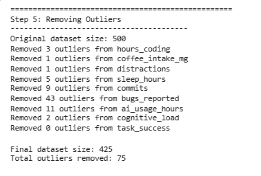
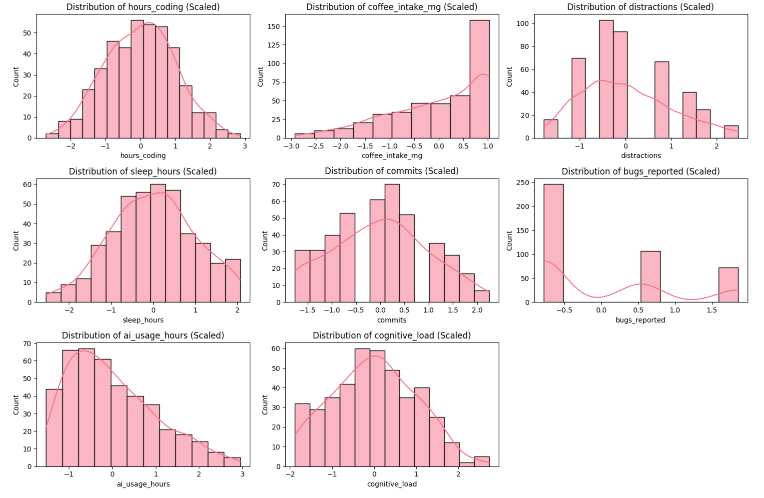
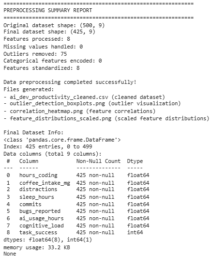

# 🚀 AI Developer Productivity - Data Cleaning & Preprocessing Pipeline

## 🧠 Overview  
Complete and efficient preprocessing pipeline for the **AI Developer Productivity Dataset**. This workflow transforms raw data into clean, structured input for machine learning models.
---
## 📊 Dataset Features  

### 🧑‍💻 Productivity  
- `hours_coding`  
- `commits`  
- `bugs_reported`  
- `task_success`  

### ☕ Lifestyle  
- `coffee_intake_mg`  
- `sleep_hours`  
- `distractions`  

### 🤖 AI Usage  
- `ai_usage_hours`  
- `cognitive_load`  

---
## 🔧 Processing Steps  

### 1. 🔍 Data Exploration  
- Load dataset and inspect structure  
- Check data types and missing values  
- Display statistics and preview rows  

### 2. 🚑 Missing Value Handling  
- **Numerical columns**: Filled with **median** (robust to outliers)  
- **Categorical columns**: Filled with **mode** (most frequent value)  

### 3. 🧬 Categorical Encoding  
- Encode text features using **Label Encoding**  
- Required for compatibility with ML models  

### 4. 🚨 Outlier Detection  
- Use **IQR method** to find outliers  
  - Formula:  
    ```
    Q1, Q3 = df[feature].quantile([0.25, 0.75])
    IQR = Q3 - Q1
    outliers = df[(df[feature] < Q1 - 1.5 * IQR) | (df[feature] > Q3 + 1.5 * IQR)]
    ``` 
- Visualize with **boxplots**

### 5. 🧹 Outlier Removal  

- Remove only if outliers are **<10%** of data  
- Preserves valuable data while filtering anomalies  

### 6. ⚖️ Feature Scaling  
- Normalize features using **StandardScaler**  
  ```python
  scaler = StandardScaler()
  X_scaled = scaler.fit_transform(X)
  ```
   Scales data to have mean = 0 and standard deviation = 1
---

### 📈 Visualization

- 🔥 Correlation heatmap  
- 📊 Scaled feature distribution plots  
- 📦 Outlier detection boxplots



---

### 💾 Export Clean Dataset


- 💾 Save final cleaned data: `ai_dev_productivity_cleaned.csv`  
- 📄 Generate visual summaries and reports

---

## ✅ Results

- 🧼 Missing values handled  
- 🔠 Categorical features encoded  
- 🧹 Outliers detected and removed  
- ⚖️ Features standardized  
- 🤖 Dataset ready for machine learning  
